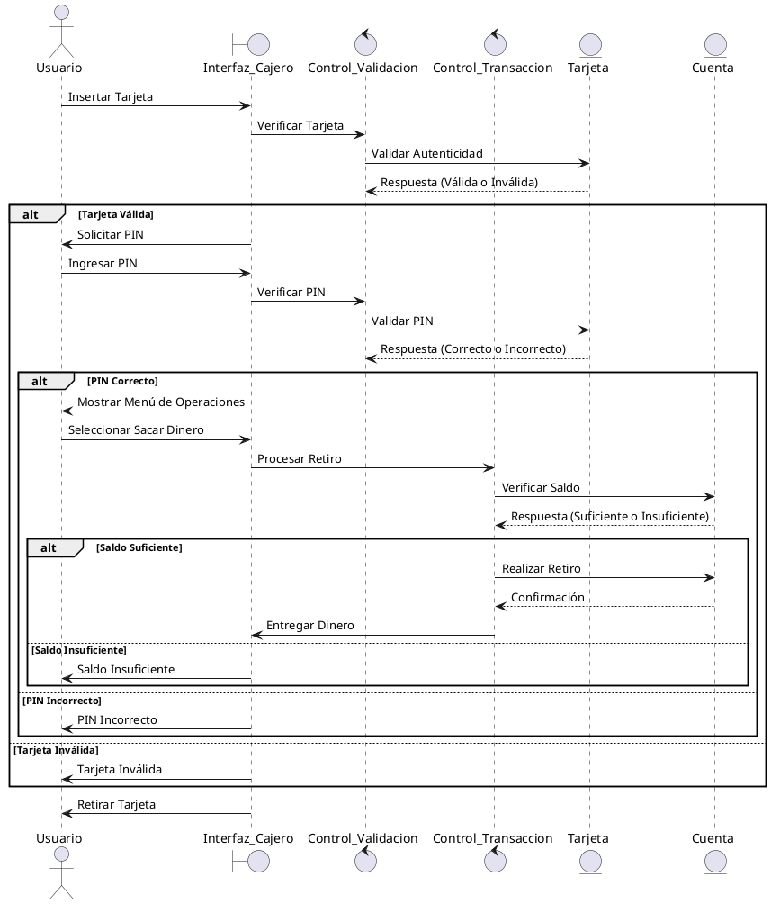
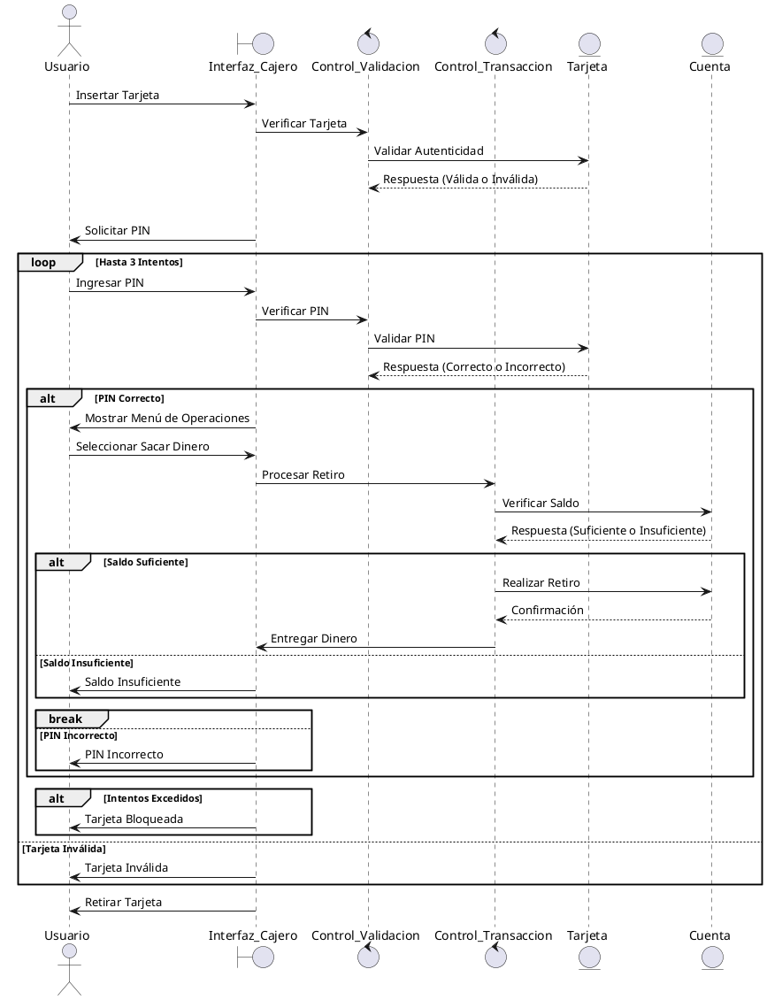

# Creación de Secuencias
## Clases Estereotipadas a partir de los casos de uso (CU: Sacar dinero y CU: Validación usuario)
**Interfaces:**

- Interfaz_Cajero (Interfaz gráfica del cajero para el usuario).

**Control:**

- Control_Transaccion (Gestiona las operaciones de transacción).
- Control_Validacion (Gestiona la autenticación del usuario).

**Entidad:**

- Tarjeta (Entidad que representa la tarjeta del usuario).
- Cuenta (Entidad que representa la cuenta bancaria asociada).

## Diagrama de Secuencias Básico
- He buscado una manera de poder poner el código mucho más correcto en md, para que se entienda mejor a la hora de ver que hace cada paso

## Diagrama de Secuencia Final

