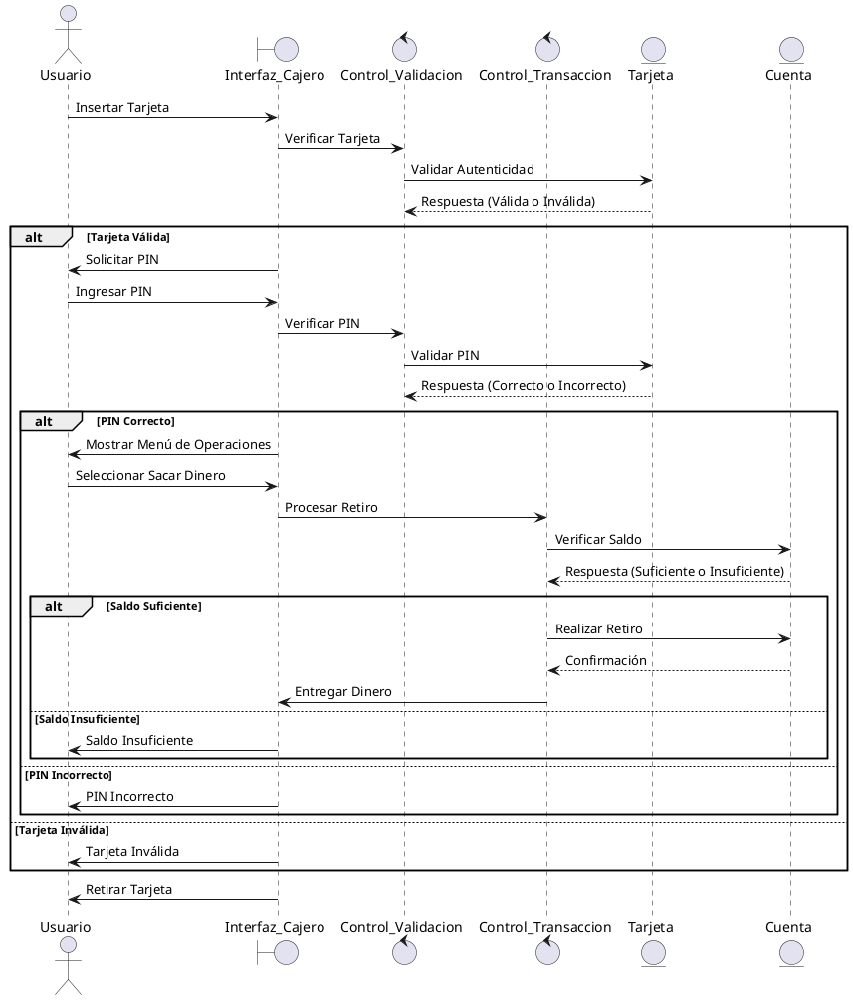
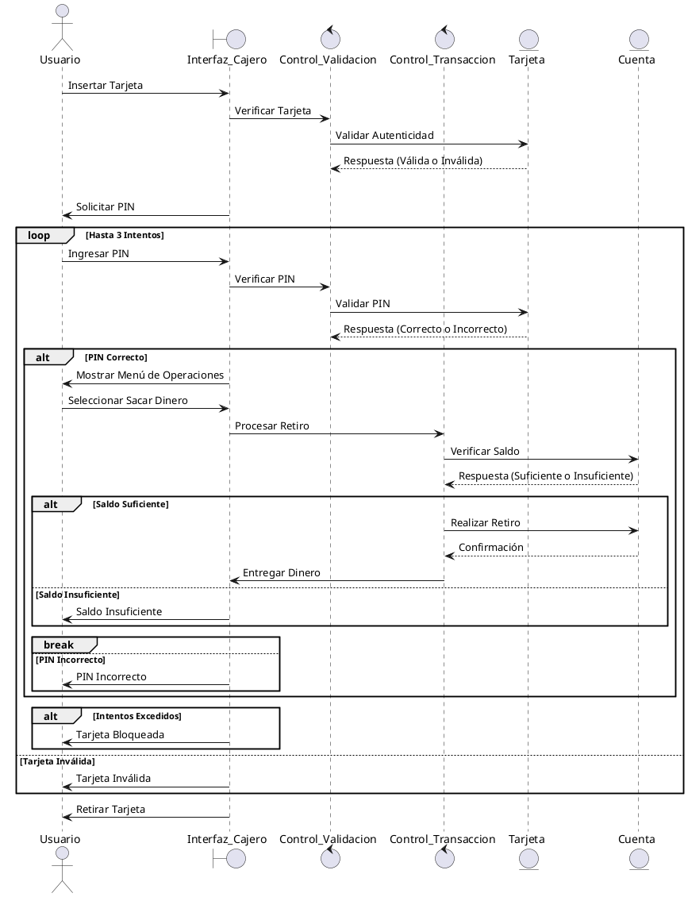

# Creación de Secuencias
## Clases Estereotipadas a partir de los casos de uso (CU: Sacar dinero y CU: Validación usuario)
**Interfaces:**

- Interfaz_Cajero (Interfaz gráfica del cajero para el usuario).

**Control:**

- Control_Transaccion (Gestiona las operaciones de transacción).
- Control_Validacion (Gestiona la autenticación del usuario).

**Entidad:**

- Tarjeta (Entidad que representa la tarjeta del usuario).
- Cuenta (Entidad que representa la cuenta bancaria asociada).

## Diagrama de Secuencias Básico
- He buscado una manera de poder poner el código mucho más correcto en md, para que se entienda mejor a la hora de ver que hace cada paso

## Clases de Diseño
Las clases estereotipadas se dividen en tres tipos principales: Interfaces, Control, y Entidad. A partir de estas, se desarrollan las clases de diseño.

**1. Interfaz_Cajero**
Clase Estereotipada (Interfaz)
- Representa la interacción con el usuario. En esta etapa, la clase "Interfaz_Cajero" muestra mensajes, solicita información y controla el flujo de interacción del usuario con el sistema.

**Clases de Diseño:**
- Atributos:
    - mensajePantalla (String) – Muestra mensajes en la pantalla.
    - intentosPIN (int) – Mantiene el contador de intentos para el PIN.
- Métodos:
    - mostrarMensaje(String mensaje): Muestra un mensaje al usuario en la pantalla.
    - solicitarPIN(): Solicita al usuario que ingrese su PIN.
    - mostrarMenu(): Muestra el menú de opciones del cajero.
    - entregarDinero(double monto): Entrega el dinero al usuario.
    - expulsarTarjeta(): Expulsa la tarjeta del cajero.

**2. Control_Validacion**
Clase Estereotipada (Control)
- Esta clase gestiona la validación del usuario: verifica que la tarjeta insertada sea válida y compara el PIN ingresado con el PIN almacenado.

**Clases de Diseño:**
- Atributos:
    - tarjeta (Tarjeta) – La tarjeta insertada por el usuario.
    - intentosRestantes (int) – Límite de intentos para ingresar el PIN correctamente.
- Métodos:
    - validarTarjeta(): Verifica si la tarjeta es válida (activa).
    - verificarPIN(String pinIngresado): Compara el PIN ingresado con el PIN almacenado.
    - estaBloqueada(): Verifica si la tarjeta está bloqueada debido a intentos incorrectos de PIN.

**3. Control_Transaccion**
Clase Estereotipada (Control)
- Esta clase gestiona las operaciones financieras como el retiro de dinero y la consulta de saldo.

**Clases de Diseño:**

- Atributos:
    - cuenta (Cuenta) – La cuenta asociada a la tarjeta del usuario.
- Métodos:
    - verificarSaldo(double monto): Verifica si el saldo disponible es suficiente para realizar una transacción.
    - realizarRetiro(double monto): Realiza el retiro de dinero de la cuenta si el saldo es suficiente.
    - consultarSaldo(): Devuelve el saldo actual de la cuenta.

**4. Tarjeta**
Clase Estereotipada (Entidad)
- La clase "Tarjeta" es una entidad que contiene la información básica de la tarjeta del usuario, como el número y el PIN.

**Clases de Diseño:**

- Atributos:
    - numeroTarjeta (String) – Número de la tarjeta del usuario.
    - pin (String) – El PIN asociado a la tarjeta.
    - activa (boolean) – Estado de la tarjeta (si está activa o bloqueada).
- Métodos:
    - getPIN(): Obtiene el PIN de la tarjeta.
    - estaActiva(): Verifica si la tarjeta está activa.
    - bloquear(): Bloquea la tarjeta si se ingresan demasiados PINs incorrectos.

**5. Cuenta**
Clase Estereotipada (Entidad)
- La clase "Cuenta" representa la cuenta bancaria asociada a una tarjeta y contiene el saldo disponible para realizar transacciones.

**Clases de Diseño:**

- Atributos:
    - numeroCuenta (String) – El número de cuenta del usuario.
    - saldo (double) – El saldo actual en la cuenta.
- Métodos:
    - getSaldo(): Retorna el saldo disponible en la cuenta.
    - setSaldo(double saldo): Modifica el saldo de la cuenta después de una transacción (por ejemplo, después de un retiro).

## Diagrama de Secuencia Final

- Ambos diagramas comparten muchas similitudes en su estructura y flujo, la diferencia es
el nivel de detalle de la versión final ya que es más precisa aunque ya lo era la primera.
- El aprendizaje para poder hacer los diagramas lo he obtenido de este video https://www.youtube.com/watch?v=xiQfSFxuuBw 
